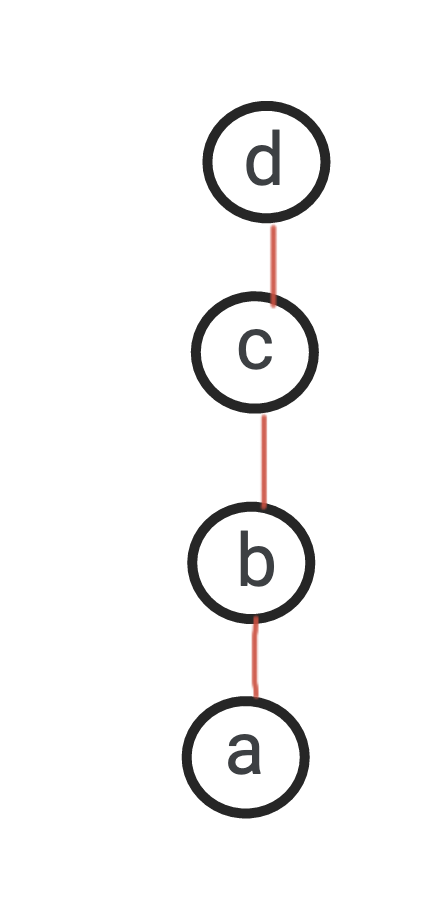
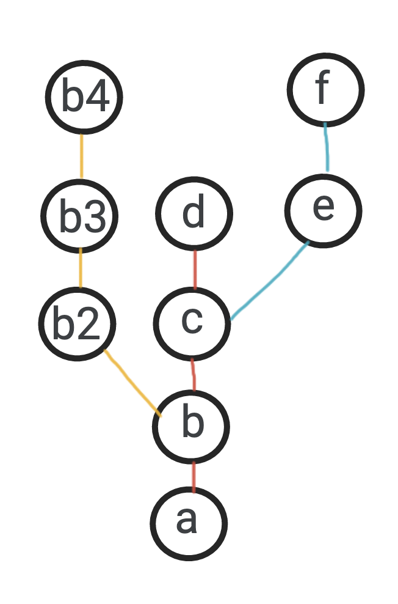
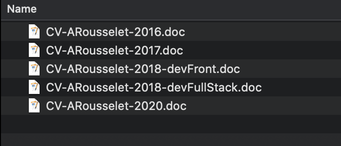
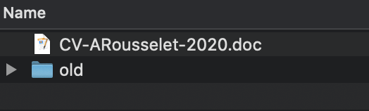
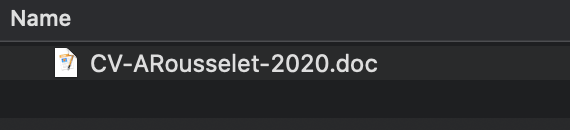
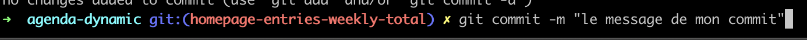

=> Slide 0
# Git pour les non-dev

=> Slide 1
## "C'est quoi ce Guitte ?"

L'idée de base, c'est de gérer les différentes version d'un fichier, qui évolue avec le temps.

Git n'a pas inventé le concept (premier soft IBM en 1962, Subversion...) mais il a développé le concept vers un outil distribué/collaboratif et ce qui a democratisé le sujet.

+ anecdote Linus Torvald (créateur de Linux) qui a dit "Les outils existants fonctionnent pas assez bien, je vais faire le mien" => 1 mois plus tard, Git était né

Date création git: avril 2005
Aujourd'hui ~70-80% des projets dev utilisent git => grosse domination

=> Slide 2
## "Ok mais... ça sert à quoi, en vrai ?"

Bah, ça sert à gérer les versions d'un fichier :troll:

Les principes de bases sont très simples (c'est pour ça que ça marche):
- on peut "enregistrer" des version de son travail (via des commits)
- on peut "stocker" l'état de ses fichiers en ligne (via des push)
- on peut "récupérer" les fichiers à un état X ou Y (via des checkout)

=> Slide 3
## "Ok et dans le détail ça donne quoi?"

- si je modifie un fichier et que je l'enregistre, il passe dans un état "à versionner" => le "stage"
- je peux décider de le versionner (seul ou avec d'autres fichiers) => le "commit"
- je peux décider de le distribuer online (seul ou avec d'autres commits)=> le "push" du commit
- si je veux récupérer des versions de fichiers qui ont été distribuées => le "checkout

Comme vous le voyez, les étapes (de base) sont très simples.
Pourtant, il n'est pas aisé de le mettre en pratique car cela demande un réel effort de changer ses habitudes. Même pour des devs ! Surtout lorsqu'on travaille en collaboration sur des fichiers partagés.

=> Slide 4
Mais les avantages sont énormes:
- j'organise mon travail de création/modification au fil de l'eau
- je peux revenir en arrière sur des modifications
- je n'ai plus de risque de perdre mon travail
- je peux travailler en collaboration avec d'autres personnes sur les mêmes fichiers
- je peux travailler sur des modifications différentes, en même temps, sans me marcher sur les pieds

... heu, attends... tu m'as perdu avec le dernier point.

=> Slide 5
## "C'est quoi cette histoire de ne pas se marcher sur les pieds ?!"

Pour faire simple, imaginons un cas de figure classique.

- Je suis un dev et je travail sur une nouvelle feature. Tout va bien, je fais mes commits, je les push etc.
- Mon PM me fait un retour sur un bug sur une autre feature.
    => Damned, je suis au milieu de ma feature... comment je vais pouvoir m'en sortir?

    - si je fix le bug tout de suite, je ne vais pas pouvoir push uniquement le fix (mais aussi tout le travail en cours) :scream:
    - si j'attends d'avoir terminé ma feature, j'en ai peut être pour des semaines avant de pouvoir faire le fix :scream:

=> Slide 6
Et c'est là qu'on découvre la puissance d'un outil comme Git car la solution est "simple":
- Je commit mon travail (feature) actuel (pour ne pas le perdre)
- Je récupère l'état du projet à une version antérieure (avant ma feature)
- Je créé une *nouvelle branche* (que je nomme par ex: fix-bug-XXX)
- Je fix mon bug sur cette branche (commit + push)
- Quand j'ai fini, je retourne sur la branche où j'ai mon travail en cours (nouvelle feature)

=> Slide 7
## "Ok, j'ai compris le besoin mais c'est quoi cette histoire de branche... ?!"

Le terme de "branche" vient du fait que si on représente visuellement l'historique, bah... il ressemble fortement à un arbre.
    - on a un tronc: l'historique principal
    - on a pleins de petites branches: qui sont les modifications "en cours" (vouées, à terme, à faire parti du tronc princpal)

<em>Un historique sans branche</em>

<em>Un historique complexe (avec plusieurs départ de branches)</em>

=> Slide 8
## "D'accord... donc c'est vraiment un truc de dev en fait !"

Eh ben en fait, pas du tout.
Alors oui, le cas d'usage typique est celui du développeur qui veut faire des modifications dans ses fichiers et garder la trace (historique) de celles-ci.
Mais en y reflechissant, on trouve pleins de situation non-tech où ça peut servir.

=> Slide 9
### Ecrivain: 
finalement c'est comme un dev. Il écrit dans des fichiers texte et il peut donc enregistrer son travail au fur et à mesure
Il peut même faire des branches différentes s'il veut écrire travailler sur un nouveau chapitre X sans valider son travail en cours sur le chapitre Y

=> Slide 9
### Recherche d'emploi:
Imaginons un étudiant. Chaque année, il doit chercher un nouveau stage.
Donc chaque année, il change son CV avec ses dernières expériences, modifie un peu la mise en page, enlève/rajoute du texte/photos etc.
Mais en même temps, pour garder un historique, il n'a pas envie d'écraser les contenus des années d'avant (ou il veut peut être faire des versions légèrement différentes selon le secteur qu'il vise) .

<em>Une manière habituelle, c'est de dupliquer les CV</em>

Ca marche plutôt bien mais c'est vite le bazar. Du coup, il réorganise son dossier pour conserver seulement la dernière version dans son répertoire et remise les autres dans un sous dossier.

=> Slide 10

<em>Cache misère du versioning</em>

Ok, c'est plus propre.
Mais c'est pénible quand même ce "old". Et imaginons que je fasse une fausse manip et que je le supprime :scream:

=> Slide 10
C'est là que Git rentre en jeu:
L'étudiant peut initialiser git dans son dossier de CV.
Il commit chacunes des modifications du CV (par ex: "git commit CV-2016") et comme ça, il n'a toujours qu'un seul fichier de CV (celui à jour) mais a la possibilité de revenir à une version antièrieure (un commit) s'il en a besoin.

<em>C'est pas propre ça ?! :broom:</em>

=> Slide 11
## "Trop bien... je vais pouvoir commit tous mes fichiers !"

Alors non.
Faut bien comprendre comment fonctionne git:

- Il enregiste l'état #1 des fichiers d'un dossier caché
- Lorsqu'il y a des modifications dans un ou plusieurs fichiers (état #2), il fait la comparaison (le "diff") entre l'état #1 et l'état #2
=> Mais :warning: il ne peut faire des comparaison que sur certains types de fichiers (principalement les fichiers composés de texte).

Git n'est pas un outil de stockage de donnée. C'est un outil de versionning de fichier.
Donc si tes fichiers ne changent pas... git ne te sers à rien.

=> Slide 12
## "Ok... mais genre ça se fait dans un terminal de commande :scream: ?"

Alors oui. Basiquement, git s'utilise en ligne de commande.

<em>Je vois les modifications de mes fichiers</em>

<em>J'ajoute les modifications à enregistrer et je les commit avec un message</em>

<em>Je récupère un autre état des fichiers</em>

Et c'est vrai que c'est perturbant.

Donc il y a aussi des GUI (interfaces graphiques) qui ont été créées pour faciliter la vie des non-dev
- Sourcetree (https://www.sourcetreeapp.com/)
- Git Kraken (https://www.gitkraken.com/)
- ...

=> présenter source tree

L'avantage de ces outils est qu'ils sont très visuels et facilitent donc la compréhension de l'historique des versions.
Personnelement, je les utilise quand j'ai fait un ensemble d'actions git et que je ne comprends plus où en est mon historique (ça arrive vite quand on a plusieurs branches imbriquées les unes dans les autres etc.)

